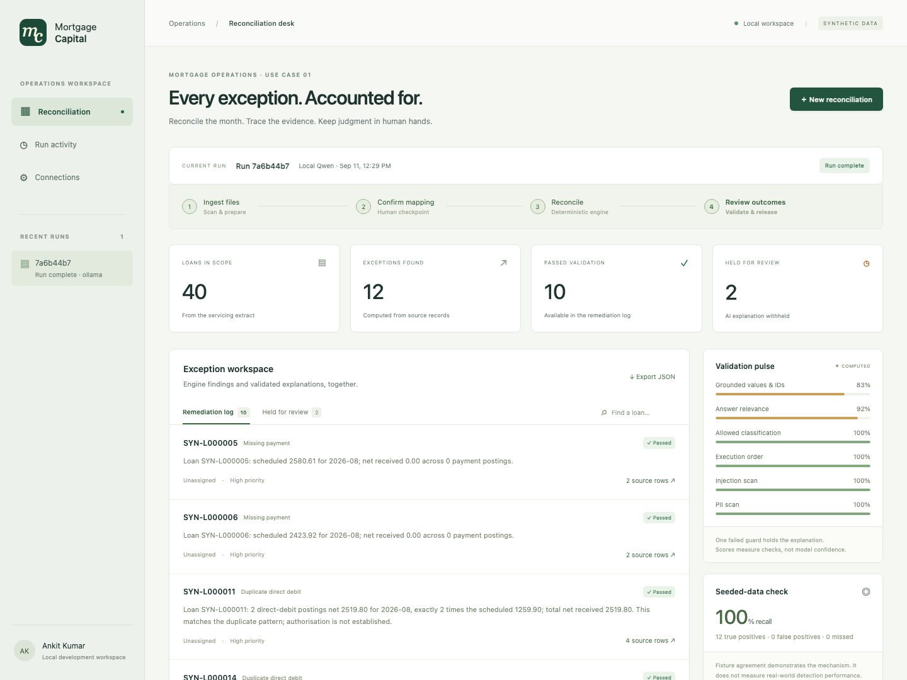

# Mortgage Capital · UC1 reconciliation desk

A local dashboard and auditable agent for reconciling three synthetic mortgage
files. Humans confirm the mapping; an integer-based engine finds discrepancies;
model explanations pass deterministic checks before release.

Works without OpenAI or Disseqt credentials. Choose real local Qwen inference or
explicit mock templates. The owner-requested dashboard and local-model extension
are recorded in [BUILD_UPDATE](docs/BUILD_UPDATE.md); the [original PRD](docs/PRD.md)
is preserved unchanged.



## Start the dashboard

Python 3.11+ is required. From the repository root:

```bash
make install
make serve
```

Open **http://127.0.0.1:8765**. The default is mock mode, requiring no model
installation or credentials. Click **New reconciliation**, use seed 42 / 40
loans, review the mapping and sample values, then **Confirm & reconcile**.
All 12 seeded exceptions should be found with zero false positives.

For the owner's chosen local model, use a compatible Ollama release:

```bash
ollama pull hf.co/empero-ai/Qwen3.8-4B-Distill-GGUF:Q4_K_M
make dashboard
```

`make dashboard` selects Ollama; `make serve` respects `LLM_PROVIDER` and defaults
to mock. The dashboard also permits explicit per-run provider selection. Missing
or failed model calls do not silently fall back to mock.

**This machine:** Ollama 0.21.2 could not load this GGUF. A separate 0.34.0 runtime
was verified with the exact model on port 11435. While using that runtime:

```bash
# Terminal 1, only if the isolated runtime is not already serving:
OLLAMA_HOST=127.0.0.1:11435 ./tmp/ollama-runtime/ollama serve

# Terminal 2:
OLLAMA_BASE_URL=http://127.0.0.1:11435 make dashboard
```

The isolated binary is a local development artifact, not committed to Git.
A compatible standard Ollama installation on port 11434 uses the normal command.
See [LOCAL_QWEN_RUN](docs/LOCAL_QWEN_RUN.md) for measured results and limitations.
The model is a pretrained community distillation; no project-specific training
was performed.

## Test and demonstrate

```bash
make test
make demo
```

`make test` runs `python -m unittest discover tests -v` inside `.venv`. The suite
uses no model/API credentials or real network services; transport tests use a
loopback fake server. It covers numerical boundaries, the real graph interrupt,
wrong mappings, poisoned drafts, provider failures and trace parity.

`make demo` starts a temporary mock server, runs seed 42, submits an explicit
**automated test confirmation**, prints results and stops that server. This is
not evidence of a human's review. With an existing dashboard server:

```bash
.venv/bin/python scripts/demo.py --provider mock
.venv/bin/python scripts/demo.py --provider ollama
```

Optional browser verification: install `requirements-dev.txt`, then
`.venv/bin/python -m playwright install chromium`. The checked-in browser smoke
script exercises mapping, results, evidence and mobile overflow:

```bash
.venv/bin/python scripts/check_dashboard.py
```

## What the dashboard shows

- Synthetic generated files or three uploaded synthetic CSVs (512 KB each).
- Editable proposed mappings and source values, followed by a required checkbox.
- Engine findings, validated explanations and verbatim source-row evidence.
- Held findings with scores/reasons; blocked model prose is absent from analyst
  APIs, the dashboard and JSON exports.
- Run activity, per-validator averages, provider usage and measured latency.
- Recall/false positives for generated datasets. Uploaded datasets have no
  invented answer key. Incomplete mappings show coverage warnings.
- A manual-baseline form; drift is unavailable until actual observations are
  entered. Comparable loan books are necessary for meaningful comparisons.

## Connect credentials later

Configuration stays on the server. `.env.example` lists supported variables;
the application does **not** automatically load `.env`. Export variables or use
an environment manager, then restart the server. Never commit keys.

| Integration | Selection | Required configuration |
| --- | --- | --- |
| Mock | `LLM_PROVIDER=mock` | None |
| Local Qwen | `LLM_PROVIDER=ollama` | Ollama + `OLLAMA_MODEL`; optional `OLLAMA_BASE_URL` |
| OpenAI | `LLM_PROVIDER=openai` | `OPENAI_API_KEY`; optional `OPENAI_MODEL` |
| Local traces | `DISSEQT_TRANSPORT=local` | Default; writes `traces/<run_id>.jsonl` |
| Live Disseqt | `DISSEQT_TRANSPORT=live` | `DISSEQT_API_KEY`, `DISSEQT_PROJECT_ID`; optional endpoint/service attribution |

A key alone never activates a paid model or live tracing. Disseqt transmission
retains a local audit and reports delivery failures. The wire format was checked
against published SDK source and a captured fake server; live registry, policy
binding, validators and dashboard visibility still require real credentials and
verification. See [DISSEQT_INTEGRATION](docs/DISSEQT_INTEGRATION.md).

## API

Interactive schema: **http://127.0.0.1:8765/docs**.

| Endpoint | Behavior |
| --- | --- |
| `POST /runs` | Generate or ingest CSVs; returns proposed mappings and paused run |
| `POST /runs/{id}/confirm` | Body `{"mapping": {"servicing": {...}, "payments": {...}, "investor": {...}}}`; resume |
| `GET /runs` / `GET /runs/{id}` | Recent runs / analyst-safe run state |
| `GET /runs/{id}/analytics` | Safe span/call summaries, validation means, usage, drift |
| `POST /baseline` / `GET /baseline` | Record/read observed `active_duration_ms` and `exception_count` |
| `GET /health` | Non-secret configuration and canonical field names |

For interactive clients, add `?background=true` to start/confirm and poll the
run endpoint. Local-model inference may take several minutes for 27 operations.
The dashboard does this automatically. Synchronous endpoints remain available
for scripts. Incomplete mappings reduce coverage and hold explanations; invalid
mappings can be corrected before confirming. Repeated confirmation returns 409.

## Architecture and boundaries

```text
CSV files --> ingestion + injection/PII scans --> model proposes mapping
                                                        |
                                              LANGGRAPH INTERRUPT
                                              human confirms mapping
                                                        |
                                           integer-only reconciliation
                                                        |
                                           model classifies and drafts
                                                        |
                                          six validators + local policy
                                                 /             \
                                              PASS            BLOCK
                                         remediation log   private draft held
                                                            engine facts visible

All steps / tools / model calls --> Disseqt wire client --> local JSONL
                                                         + optional live delivery
Browser dashboard --> FastAPI --> one graph/provider/checkpointer per run
```

The engine uses cents/basis points, matches per loan within one month, and never
imports a model provider. Duplicate detection is the specified net-multiple
pattern; the files cannot establish authorisation. Investor cash is derived from
the payment ledger in the generator, so it is not independent assurance.

Faithfulness checks membership of numbers, dates and synthetic identifiers. It
cannot prove semantic truth or correct value-to-field assignments. The UI always
shows the deterministic finding alongside accessible source evidence. No payment
is executed or authorised by this application.

Run state and baseline are in memory, capped at 50 runs per server session.
Restarting clears the dashboard history and pending checkpoints. Synthetic input
copies remain in `tmp/runs/`; audit JSONL survives in `traces/`. This is a local
PoC without multiuser authentication, durable job recovery or production controls.

## Layout

```text
app/engine.py           Pure matching, detectors, source evidence and scoring
app/providers.py        Mock / OpenAI / local Ollama and measured call records
app/validators.py       Six guards and fail-closed local policy
app/graph.py            LangGraph checkpoint, execution and safe read models
app/disseqt_wire.py     Local audit and optional live HTTP transport
app/main.py             FastAPI endpoints and static dashboard hosting
app/static/             Dashboard HTML, CSS and JavaScript
scripts/                Automated API demo and browser smoke check
data/generate_samples.py  Seeded synthetic generator and independent answer key
tests/                  Offline unittest suite
docs/                   PRD, audits, contracts, build notes and local-run record
WALKTHROUGH.md          Six-minute reviewer narrative and honest limitations
```

Optional container: `docker build -t uc1 .`, then
`docker run --rm -p 127.0.0.1:8765:8765 uc1` for mock mode. The Dockerfile is
provided; Docker execution was not verified: the local Docker daemon is not running.
