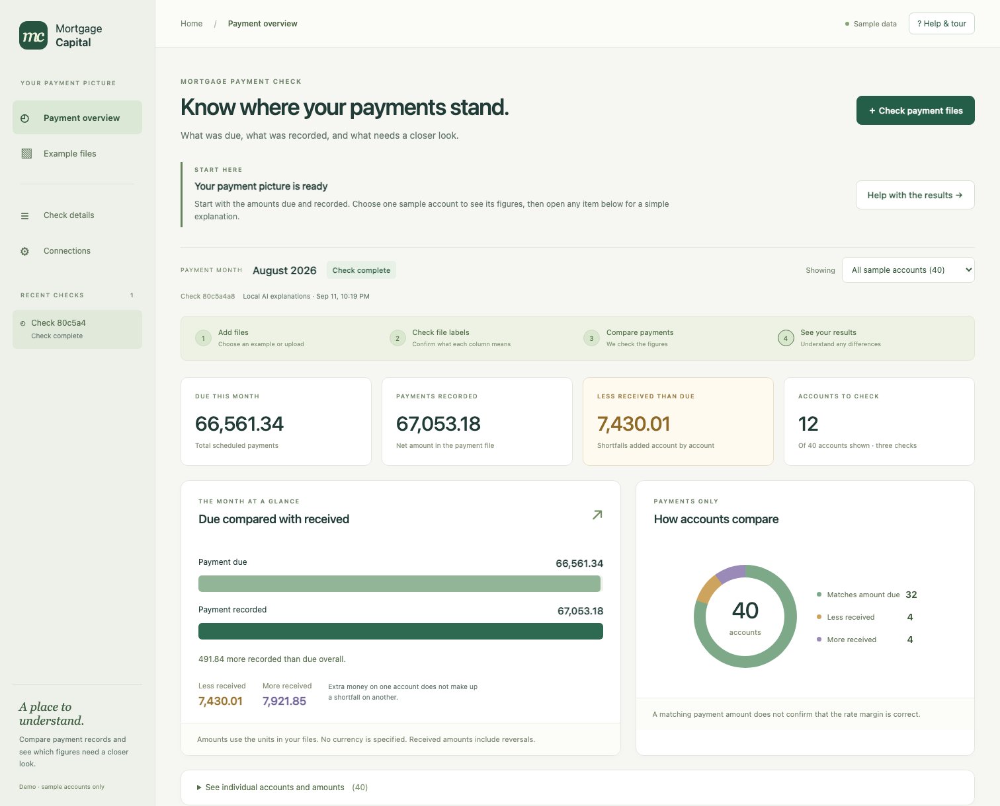
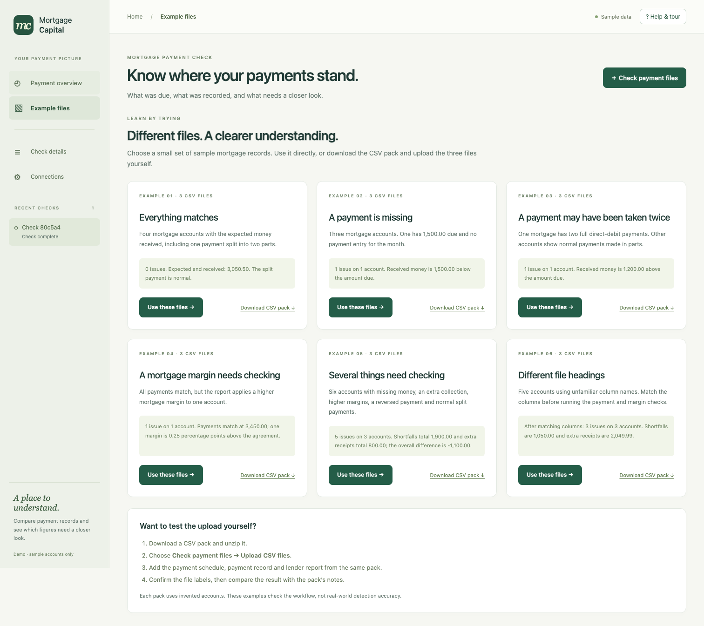

# Consumer payment overview — 11 September 2026

The owner asked to replace an operations-oriented reconciliation screen with a
dashboard mortgage/financial consumers can understand. The overview now leads
with payment amounts, due-versus-received bars, account comparison counts and
plain-language descriptions. A selector shows one sample account or the whole
sample set. Technical scores, model usage and raw rows remain available under
optional details. The tutorial follows the new screens and terminology.

## What the figures mean

All numerical figures are computed after mapping confirmation from the same
validated rows accepted by the deterministic engine. `app/payment_summary.py`
uses integer minor units, serializing money as decimal strings. The browser
formats those strings and uses floating point only for chart proportions.

| Display | Definition |
| --- | --- |
| Due this month | Sum of scheduled amounts for the selected accounts |
| Payments recorded | Sum of net payment entries, including reversals |
| Less received than due | Sum of max(due − received, 0) per account |
| More received | Sum of max(received − due, 0) per account |
| Accounts to check | Unique accounts with at least one of the three engine findings |
| Payment comparison circle | Accounts whose received amount equals, falls below, or exceeds their scheduled amount |

Shortfalls and excess receipts never cancel across accounts. A single account
can have multiple findings; it counts once in Accounts to check. Payment amount
matches do not establish correct margins. Excess cash need not satisfy the
specific duplicate-debit detector; the unfamiliar-headings pack demonstrates it.

Incomplete mappings suppress the payment summary instead of inventing zeros.
Missing lender-report rows leave reported cash/margins unknown and display the
reduced margin-comparison coverage. No currency, mortgage balance, full interest
rate, APR, repayment forecast or historical trend is inferred. The data covers
one reporting month. This remains a local sample-data PoC, not an authenticated
customer account portal.

The main descriptions use fixed templates filled with trusted source figures.
They are distinct from the optional model rationale. If the rationale fails
checks, it remains withheld; financial facts and source records stay visible.
Original detector definitions, M1 generation, validators and provider prompts
were not changed for this redesign.

## CSV example library

A separate agent independently authored six small packs under
`data/scenarios/`: all clear, missing payment, duplicate payment, margin
mismatch, mixed checks and unfamiliar headings. There are 18 CSVs, plus mapping
guides, expected results, raw-file hashes and a catalog. They include normal
split payments, reversals, zero scheduled amounts, overlapping findings and a
receipt below the duplicate threshold.

**Example files → Use these files** fetches only the three CSV texts and sends
them through the regular upload endpoint. It does not supply an answer key or
approve a mapping. Downloads contain the same CSV bytes plus guides/expected
results for review. Unknown pack IDs return 404; there is no arbitrary file path
download endpoint. Uploaded checks retain a null generated-fixture score.

## Verification

- **97 automated tests pass**, including the six-pack integration test and
  tests for missing mappings, missing lender rows and download/upload parity.
- The separate-agent harness uploaded every pack twice through FastAPI and the
  real LangGraph interrupt: **12 completed uploads**. Independent CSV/Decimal
  controls match all account totals, chart counts, finding identities and raw
  evidence. Missing-file uploads and malformed amounts fail as expected.
- Browser acceptance exercised the original monthly sample, account selection,
  payment/rate result filters, source details, the tutorial, one-click example
  preparation, and **all six ZIP downloads followed by actual CSV file inputs**.
  Every uploaded result matched its independent expected amounts and counts.
- The browser verified human confirmation, preservation of mapping edits when
  using help, inline missing-file errors, keyboard focus and viewport widths
  320, 390, 768, 1024 and 1440. A mobile button-spacing issue was fixed and its
  final position checked. No browser errors occurred.

These scenario tests use the mock provider and do not measure Qwen's reliability
on every dataset. Expected results are external test controls, never passed to
the production graph. Test confirmations do not claim owner review.

## Fresh Qwen demonstration

Run `80c5a4a8-e394-48b2-8e0e-4a9a6524eed1` used the owner-selected local model
with seed 42 / 40 accounts. It found 12 exceptions on 12 accounts, with 10 model
explanations available and 2 withheld. There were 27 real model operations,
9,775 recorded tokens and about 283 seconds of active processing. No OpenAI
calls or Disseqt cloud calls were made; traces remained local.

The overview shows 66,561.34 due, 67,053.18 recorded, 7,430.01 of account
shortfalls and 7,921.85 of excess receipts. Its payment circle shows 32 matching
accounts, 4 below and 4 above scheduled amounts. A fresh browser check confirmed
these figures, one-account filtering, source details and withholding of the
failed Qwen explanation. The measured record is [consumer_qwen_run.json](consumer_qwen_run.json).

Reproduce with `make test`, `.venv/bin/python -m scripts.check_scenarios`, and
`.venv/bin/python scripts/check_dashboard.py --url http://127.0.0.1:8767` against
an isolated running test server. The browser check creates mock runs. The
separate SDK/Qwen transport evidence remains documented in
[SDK_QWEN_RUN](SDK_QWEN_RUN.md).
